### Matthew Mackey
### CSC-580-810 

# Final Project Overview

This project involved training reinforcement learning agents on 3 different environments with different parameters and analyze the effects.

## Highway Environment

This environment was used to train DQN, PPO, and A2C algorithms. Two models of each type were trained with varying parameters. It is intended to be used as the easiest environment to learn compared to the others. It involves a straight highway with other vehicles driving and changing lanes.

[Highway Training](Highway.py)

We can see how each of the algorithms compare between the two models trained for each. The larger network, higher gamma, and lower learning rates seem to lead to better learning.

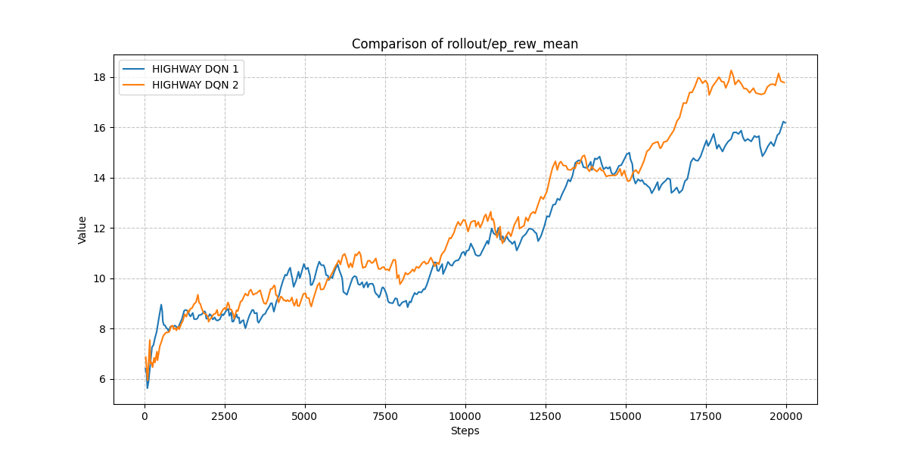

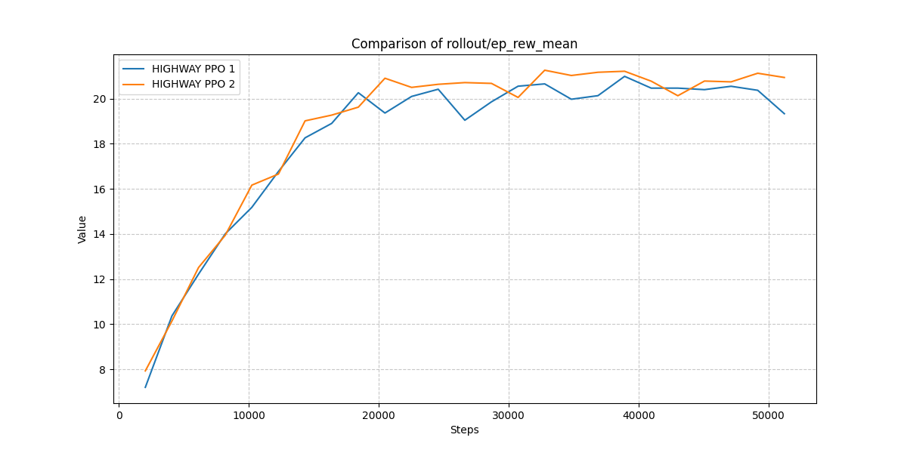

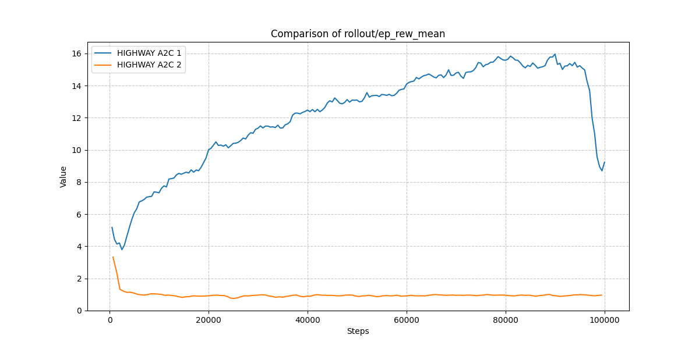

And here we can see them all compared both without and with normalized training steps. The PPO ends up learning the policy with the highest values.

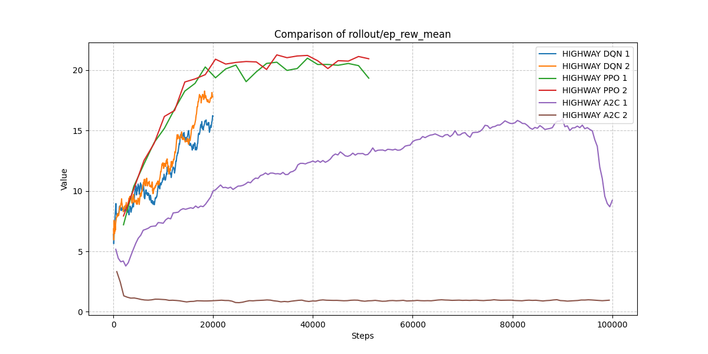

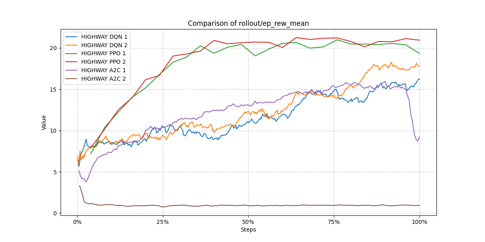

## Roundabout Environment

This environment was used to train DQN, PPO, and A2C algorithms. Two models of each type were trained with varying parameters. It is the most difficult environment involving multiple obstacles and a curved road with multiple turns.

[Roundabout Training](Roundabout.py)

In this environment, we're comparing the same models as in highway so we can see how different difficulties affect the changes in parameters during training.

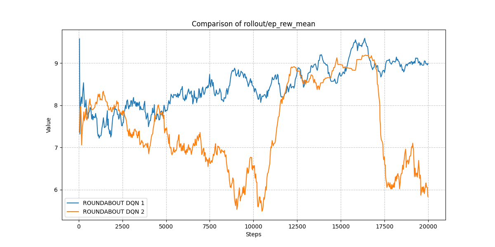

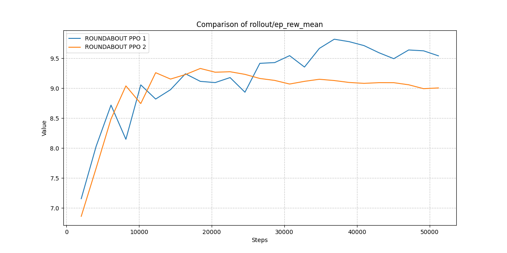

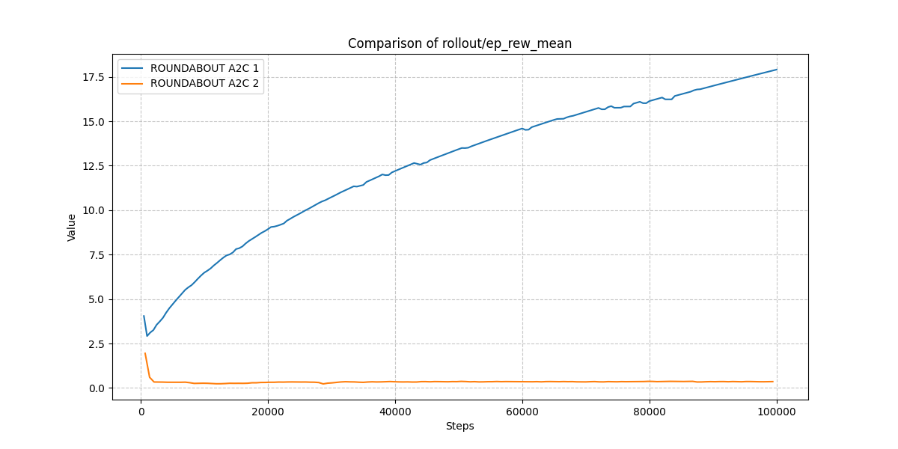

Here are the comparisons for all models. Despite the performance appearance on these charts, the DQN makes the best attempt at this problem according to the testing videos.

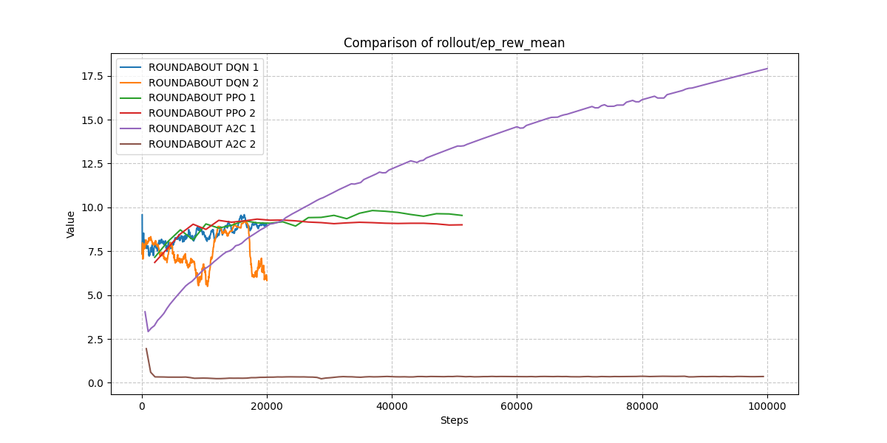

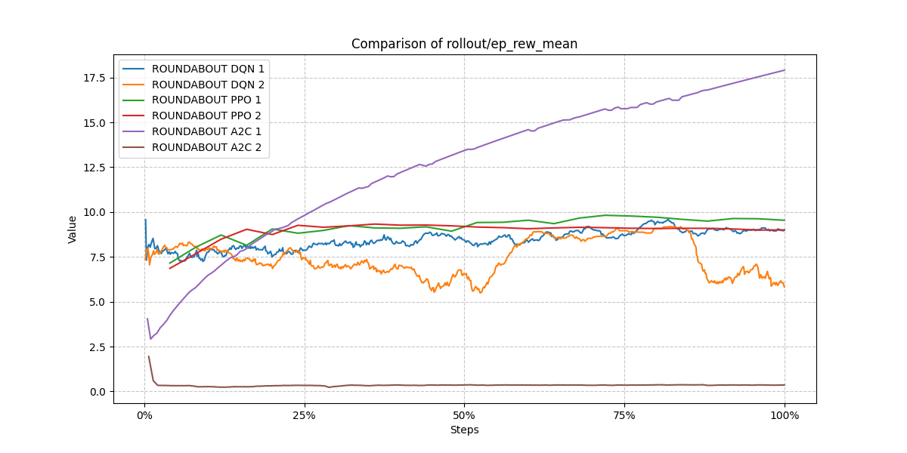

## Racetrack Environment

This environment was used to train TRPO, PPO, and A2C algorithms. DQN could not be used here because this environment is in a continuous controlled problem space. Two models of each type were trained with varying parameters. It is medium difficulty compared to the highway and roundabout environments. The goal with this environment is to utilize what I've learned from experimenting on the previous environments to build an optimal agent.

[Racetrack Training](Racetrack.py)

In this environment, we're comparing TRPO, PPO, and A2C. This experiment tests each algorithm using one set of parameters to see how making adjustments based on the two previous environments can lead to optimized learning on a new, but similar task. The main difference between this environment and the others is that it uses continuous control while the car races around the track.

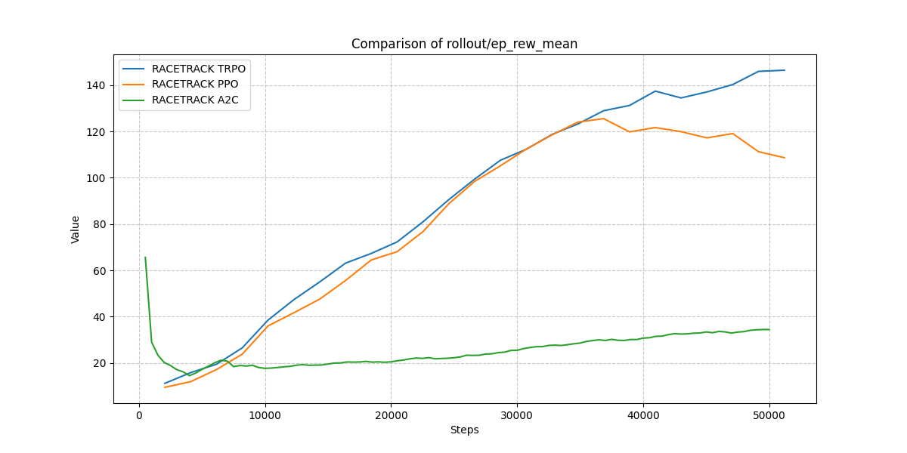

These models all learned the environment well, each of them making multiple laps while maneuvering around other vehicles. Each used 3 hidden layers with the shape [256, 256, 256], they all used a gamma = .95, and they used learning rate of 1e-4. TRPO performed the best, with a fast and smooth ride around the circuit, while A2C was the slowest with a jerky policy as it nears walls. 